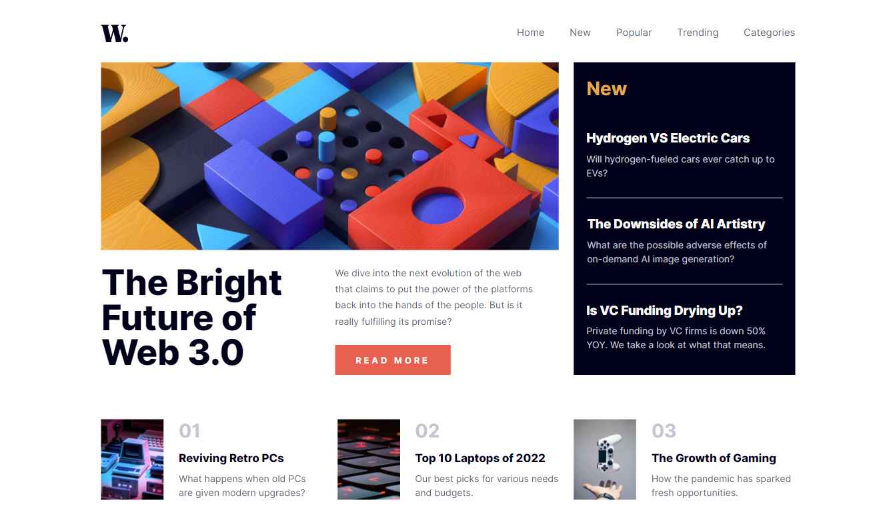

# Frontend Mentor - News homepage solution

This is a solution to the [News homepage challenge on Frontend Mentor](https://www.frontendmentor.io/challenges/news-homepage-H6SWTa1MFl). Frontend Mentor challenges help you improve your coding skills by building realistic projects.

## Table of contents

- [Overview](#overview)
  - [The challenge](#the-challenge)
  - [Screenshot](#screenshot)
  - [Links](#links)
- [My process](#my-process)
  - [Built with](#built-with)
  - [What I learned](#what-i-learned)
  - [Continued development](#continued-development)
  - [Useful resources](#useful-resources)
- [Author](#author)

## Overview

### The challenge

Users can:

- View the optimal layout for the interface depending on their device's screen size.
- See hover and focus states for all interactive elements on the page.
- Toggle the mobile menu.

### Screenshot



### Links

### Links to be added

- Solution URL: [Add solution URL here](https://your-solution-url.com)
- Live Site URL: [Add live site URL here](https://your-live-site-url.com)

## My process

### Built with

- Semantic HTML5 markup
- Flexbox
- CSS Grid
- Mobile-first workflow
- [TailwindCSS](https://reactjs.org/) - CSS Utillity Class Library

### What I learned

This is the second project I have built with tailwind and besides the main benefits of using it, I have noticed couple of things I didn't before.

For Example, the speed that I style things using utillity classes is a massive help, just being able to apply basic styles to things like text makes a massive difference to the speed in building the UI. It also removes most of the default stylings for certain elements, like buttons, and saves us the job of removing the defaults. Which straight away is a time saver.

Another thing I noticed was that I wasn't naming any of the classes for the elements, again this saves us time because we don't have to think of classes names to us. It also is a great benefit to have when working in a team because you don't have to guess what an obscure class name is doing, you already know what that classes is and what it's doing.

Here you can see straight away what is happening to this element based on the classes applied:

```html
<aside
  id="sidebar"
  class="fixed right-0 z-10 h-full w-64 translate-x-full bg-offWhite transition duration-1 ease-in-out"
>
  ...
</aside>
```

### Continued development

I look foward to using tailwind in bigger projects and to learn more about it.
I would also like to see how it adapts to those projects, and the benefits it could bring in the future. 

### Useful resources

- [TailwindCSS Documentation](https://www.example.com) - This has been my only resource, so far, when learning tailwind.


## Author

- Website - [David Henery](https://www.djhwebdevelopment.com)
- Frontend Mentor - [@David-Henery4](https://www.frontendmentor.io/profile/David-Henery4)
- linkedIn - [David Henery](https://www.linkedin.com/in/david-henery-725458241)


